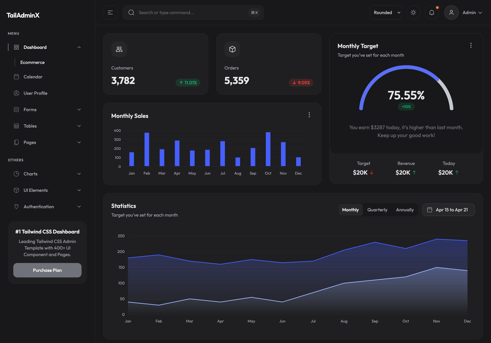

# TailAdminX

TailAdminX is a React admin dashboard and UI library: layouts, charts, tables, forms, and supporting components, built with **React 19**, **TypeScript**, and **Tailwind CSS v4**. Use it as a Vite demo app in this repo or consume the published package in your own application.

## Stack

- React 19
- TypeScript
- Tailwind CSS v4
- Vite

## Development

**Prerequisites:** Node.js 18 or later (20+ recommended).

Install dependencies and start the dev server:

```bash
npm install
npm run dev
```

Build the demo application:

```bash
npm run build
```

## Library build

Produce the distributable library under `dist-lib`:

```bash
npm run build:lib
```

Dry-run the package contents:

```bash
npm run package:check
```

## Using the package

Import styles once in your app entry:

```tsx
import "@cloudvisionapps/tailadminx/styles.css";
```

Basic component import:

```tsx
import { Button, Modal, InputField } from "@cloudvisionapps/tailadminx";
```

Configurable layout example (custom logo, links, and menu items):

```tsx
import {
  AppLayout,
  type SidebarNavItem,
  defaultMainMenuItems,
  defaultSecondaryMenuItems,
} from "@cloudvisionapps/tailadminx";

const mainMenuItems: SidebarNavItem[] = [
  ...defaultMainMenuItems,
  {
    name: "Docs",
    path: "/docs",
    icon: <span>D</span>,
  },
];

export default function DashboardShell() {
  return (
    <AppLayout
      headerProps={{
        brandLink: "/dashboard",
        brand: <span>My Admin</span>,
        searchPlaceholder: "Search users, reports, settings...",
      }}
      sidebarProps={{
        mainMenuItems,
        secondaryMenuItems: defaultSecondaryMenuItems,
        brandLink: "/dashboard",
        brandFull: ,
        brandCompact: ,
      }}
    />
  );
}
```

### Tailwind in consumer apps

By default, importing the package stylesheet is enough:

```tsx
import "@cloudvisionapps/tailadminx/styles.css";
```

If your app runs its own Tailwind build and needs to scan this package’s markup for utilities:

**Tailwind v4** — add a `@source` directive in your app stylesheet:

```css
@import "tailwindcss";
@source "../node_modules/@cloudvisionapps/tailadminx/dist-lib/**/*.{js,cjs}";
```

**Tailwind v3** — include the package in `content` in your Tailwind config:

```js
export default {
  content: [
    "./src/**/*.{js,ts,jsx,tsx}",
    "./node_modules/@cloudvisionapps/tailadminx/dist-lib/**/*.{js,cjs}",
  ],
};
```

The package ships compiled CSS (`@cloudvisionapps/tailadminx/styles.css`). Use the discovery setup only when your pipeline must scan package files for class names.

## Publishing

1. Bump the version in `package.json`.
2. Create and push a version tag (pattern `v*.*.*`), or run the release workflow manually with a tag input.

The release job installs dependencies, runs `npm run build` and `npm run build:lib`, publishes the package, and attaches build archives to a GitHub release. Full steps and permissions are defined in `.github/workflows/release.yml`.

`prepublishOnly` runs `npm run build:lib` before a local `npm publish` if you publish by hand.

## License

MIT
